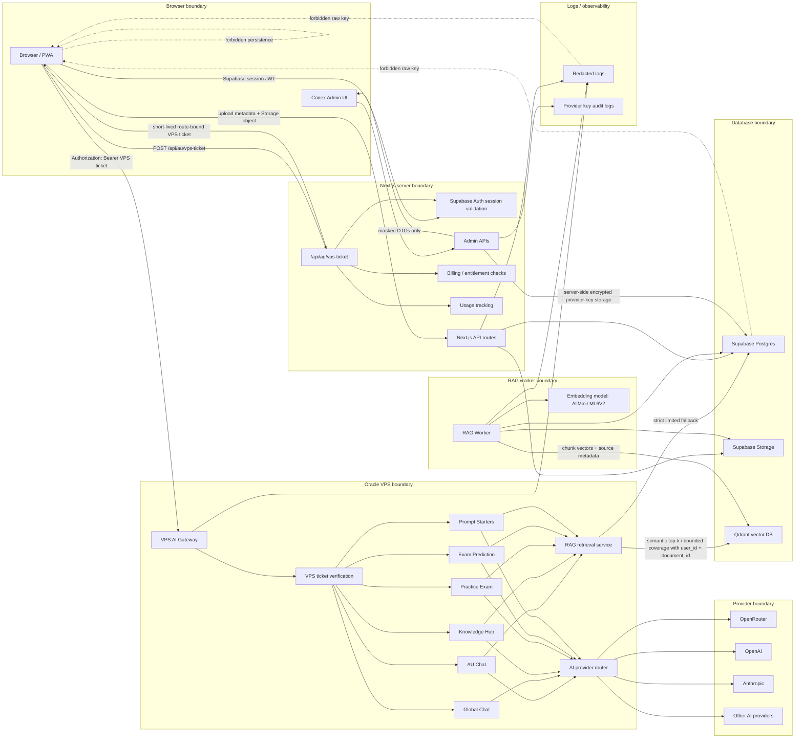

# DataCube AU AI/RAG Pipeline

Last updated: 2026-07-28

## Diagram



## Request Lifecycles

AU Chat: the browser uses its Supabase session to call `/api/au/vps-ticket`. Next.js checks auth, entitlement, and limits, then signs a short-lived ticket with user, feature, route, issuer, audience, expiry, and unique ID. The browser sends that ticket to the VPS gateway. The VPS verifies the ticket and ignores browser-supplied user, route, feature, and plan fields. If a document is present, retrieval uses Qdrant semantic top-k with both `user_id` and `document_id`; fallback is bounded Supabase chunk retrieval. The gateway sends capped context to the provider router and returns text plus citations.

Upload and ingestion: the browser creates upload metadata through Next.js/Supabase and uploads the private source object to Supabase Storage. The RAG worker claims a job, downloads the object with server credentials, extracts and chunks text, embeds chunks with `AllMiniLML6V2`, writes chunk metadata to Supabase Postgres, writes vectors and source payload to Qdrant, reconciles completion, and performs source cleanup where configured.

Document-grounded generation: Knowledge Hub, Practice Exam, Exam Prediction, and Prompt Starters call the VPS generation routes with a valid route-bound ticket. The gateway uses bounded coverage retrieval, never full `au_documents.content_text` hydration, and never dummy vectors for queryless generation. Source metadata is preserved in the response.

## Egress Points

Supabase egress: auth/session validation, entitlement reads, usage writes, upload metadata, worker job claim/update, bounded chunk fallback, admin masked DTOs, and redacted audit logs.

Qdrant egress: semantic top-k searches, bounded scroll coverage, bounded synthesized intent queries, and payload metadata for citations. Required filters are `user_id` and `document_id`.

AI provider egress: capped context, capped history, capped output tokens, provider-router retries, and sanitized provider failures.

Browser/PWA egress: Supabase session Authorization, short-lived VPS ticket Authorization, upload requests, non-sensitive admin DTOs, private API network-only behavior, and offline queued writes without persisted Authorization headers.

## Failure Points

Missing `VPS_SHARED_SECRET`, missing production `ALLOWED_ORIGINS`, malformed/expired/tampered/wrong-route tickets, missing `document_id` for RAG, Qdrant timeout, provider timeout, provider non-JSON/error response, Supabase schema drift, stale service worker, and unmatched embedding model configuration.

## Security Boundaries And Secret Ownership

Browser owns no provider secrets, no service-role key, no Qdrant key, and no long-lived admin credential. It may temporarily hold a short-lived route-bound VPS ticket for gateway calls.

Next.js owns Supabase server credentials, `VPS_SHARED_SECRET` for ticket signing, billing/webhook secrets, and admin key-management endpoints.

Oracle VPS owns `VPS_SHARED_SECRET` for ticket verification, Qdrant credentials, provider API keys used by the gateway, and redacted operational logs.

RAG worker owns Supabase service credentials, Qdrant credentials, Storage read/write capability, and the embedding runtime/cache.

Supabase owns Auth state, Postgres records, Storage objects, usage/audit rows, and credential metadata. Provider keys are server-only, new admin writes use encrypted storage metadata, and raw values must not be selected into browser DTOs.

Qdrant owns vector payloads and chunk source metadata. Payload filters must enforce `user_id` plus `document_id`.

## Rendering

The source diagram is stored in `docs/architecture/datacube-au-ai-rag-pipeline.mmd`. Render with Mermaid CLI when available:

```bash
mmdc -i docs/architecture/datacube-au-ai-rag-pipeline.mmd -o docs/architecture/datacube-au-ai-rag-pipeline.svg
```
