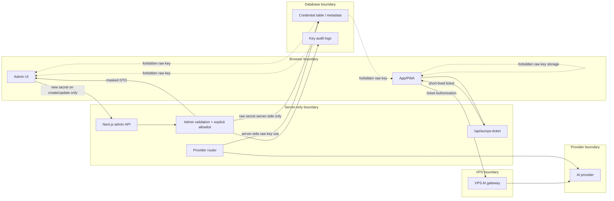

# DataCube AU API Key Pipeline Audit

Last updated: 2026-07-28

Status model:

- Green = fixed and verified in repo/tests
- Yellow = partly fixed or needs live verification
- Red = confirmed unsafe until rotation or manual remediation is complete
- Grey = cannot verify from repo alone

No raw secret values are included in this report.

## Executive Status

| Area | Status | Result |
|---|---|---|
| Browser/provider-key exposure | Green | Admin provider-key DTOs expose only configured status, last4/fingerprint, provider name, timestamps, and status fields. |
| Legacy Conex admin token pipeline | Green | Custom admin token storage/header flow was removed from the browser. Old stored values are cleanup-only. |
| Tracked secret exposure cleanup | Red | Confirmed tracked historical credential values were removed, but rotation is required because tracked exposure occurred. |
| Secret table controls | Yellow | Migration adds credential metadata, audit logs, RLS/revokes, and service-role-only access. Encryption-at-rest is still not implemented. |
| Public/service-worker exposure | Green | Static checks assert no high-confidence raw secret values or credential plumbing in tracked public files. |

## Secret Categories Audited

| Secret category | Primary storage | Components that use it | Browser-visible | Status | Required action |
|---|---|---|---|---|---|
| Supabase anon/publishable key | `NEXT_PUBLIC_SUPABASE_ANON_KEY` / `SUPABASE_ANON_KEY` | Browser client, server proxy calls | Yes, by design | Green | Keep scoped as anon/publishable only. |
| Supabase service-role / secret key | Server env only | Next.js admin APIs, RAG worker, VPS gateway optional server reads | No | Red | Rotate because a service-role-looking value was found in tracked backend scripts. |
| Supabase JWT secret references | Env/config references only | Supabase Auth/JWT validation context | No | Grey | Verify live Supabase project secret never appears in repo, logs, or generated files. |
| `VPS_SHARED_SECRET` | Next.js server env and Oracle VPS env | `/api/au/vps-ticket`, VPS gateway verifier | No raw value; short-lived ticket is browser-visible by design | Yellow | Ensure matching values on Next.js and Oracle VPS; rotate after deploy if exposure suspected. |
| Qdrant API key | Server/VPS/worker env | VPS gateway retrieval, RAG worker, retention/repair tools | No | Green | Keep off `NEXT_PUBLIC_*`; verify Oracle VPS log redaction. |
| OpenAI API key | VPS env or provider table if configured | Gateway provider router / server model router | No | Green | Rotate any historical exposed provider keys; keep server-only. |
| OpenRouter API key | VPS env or `au_api_keys` / `ai_provider_keys` | Gateway provider router / server model router | No | Red | Rotate confirmed tracked historical provider keys. |
| Anthropic API key | VPS env | Gateway provider router | No | Green | Keep server-only and out of logs. |
| Google/Gemini API key | Env if present | Provider router if added later | No | Grey | No active repo path confirmed in this pass. |
| Paystack secret key | Server env | `src/lib/server/paystack.ts`, billing sessions/webhooks | No | Green | Keep server-only, rotate if deployment logs ever exposed. |
| Paystack public key | Public env/config if used | Browser checkout | Yes, by design | Green | Public key only; never substitute secret key. |
| Flutterwave secret key | Server env | `src/lib/payments/flutterwave.ts`, webhook route | No | Green | Keep server-only. |
| Flutterwave public key | Public env/config if used | Browser checkout | Yes, by design | Green | Public key only. |
| Webhook secrets | Server env | Paystack/Flutterwave webhook verification | No | Green | Keep no-store responses and bounded request bodies. |
| Admin override credentials | Historical `au_admin_config`; current Supabase admin authorization | Server/db only | No | Red | Rotate historical values and migrate to env/encrypted storage. |
| Provider registry keys | `au_api_keys` / optional `ai_provider_keys` | Admin handler, server AI routing | No | Yellow | Migration adds metadata/audit. Add encryption-at-rest next. |
| Model routing provider keys | Same as provider registry | Server AI routing | No | Yellow | Server-only raw read remains necessary for provider calls. |
| Generated signed VPS ticket | Generated by `/api/au/vps-ticket` | Browser sends to VPS gateway | Yes, short-lived bearer | Yellow | Keep 5-minute TTL, route binding, no logging, no persistence. |
| Authorization bearer token | Supabase session/browser requests; VPS ticket/gateway requests | Browser, Next.js, VPS | Yes for active sessions | Green | Do not persist in offline queue; never log. |
| Refresh token | Supabase auth storage | Browser Supabase client | Yes, managed by Supabase client | Yellow | Verify browser storage configuration and sign-out cleanup in live clients. |
| Cookie/session token | Browser cookies/session | Next.js auth | Yes, by design | Green | No service worker caching of private API responses. |

## Credential Tables

| Table | Columns / secret fields | Access and code paths | RLS / service-role status | Browser risk | Status |
|---|---|---|---|---|---|
| `public.au_api_keys` | Raw: `key_value`; masked: `key_last4`, `key_fingerprint`; metadata: `rotated_at`, `revoked_at`, `last_used_at`, `created_by`, `updated_by` | `src/app/api/admin/handler/route.ts`, `src/lib/server/ai-routing.ts` | Migration enables RLS, revokes anon/authenticated, grants service_role, and adds audit metadata. Server AI routing reads `key_value` explicitly. | Admin browser gets masked DTO only. | Yellow |
| `public.ai_provider_keys` | Optional compat table with possible `key_value`; migration adds mask/audit metadata if it is a real table | `src/lib/server/ai-routing.ts` fallback | Migration hardens if table exists as a table. | No browser route should expose it. | Yellow |
| `public.au_key_groups` | Historical `api_key`; migration adds `api_key_last4`, `api_key_fingerprint`, rotation/revocation metadata if table exists | No active current app path found | Migration hardens if table exists. | Not browser-facing in current repo. | Yellow |
| `public.au_admin_config` | Historical `challenge_answer` and `admin_access_key` seed values | Legacy backend migration only in tracked repo | Historical raw values removed from migration. Live table may still contain old values if previously applied. | Should never be directly client-readable. | Red |
| `public.au_admin_sessions` | Session IDs and lockout state, no provider key | Legacy/admin auth flows | Migration hardens if table exists. | Browser no longer stores returned custom admin token. | Yellow |
| `public.admin_access_logs` | IP, attempt count, lockout timestamp | `src/app/api/admin/auth/route.ts` | Explicit select only; server-side admin client. | Not browser raw credential data. | Green |
| `public.au_config` | Billing/config fields and `alert_config`, no raw provider key intended | `src/app/api/admin/handler/route.ts`, `rag-worker/src/worker.ts`, background config route | Admin handler now uses explicit DTO. Existing historical policy may allow public reads; not treated as secret table unless secret data is inserted. | Could leak if secrets are mis-stored there. | Yellow |

RLS alone is not considered sufficient for credential tables. The implemented controls are server-only access, explicit column selection, masked DTOs, no raw key echo on create/update/delete, audit metadata, and static tests. Encryption-at-rest is still a required follow-up.

## API Routes And Functions

| Route/function | Reads credentials | Returns credentials | Status |
|---|---:|---:|---|
| `src/app/api/admin/handler/route.ts` | Yes, server-only provider key create/update and registry metadata | No raw values; masked DTO only | Green |
| `src/lib/server/ai-routing.ts` | Yes, server-only provider key use | No browser response path | Yellow |
| `src/app/api/admin/auth/route.ts` | Uses Supabase anon key server-side for Edge proxy | Sanitizes upstream token/secret fields | Green |
| `src/app/api/au/vps-ticket/route.ts` | Uses `VPS_SHARED_SECRET` server-side | Returns short-lived signed VPS ticket by design; no raw shared secret | Yellow |
| `vps-ai-gateway/src/index.ts` | Uses VPS shared secret, Supabase server key, Qdrant key | No secret in health/errors/logs | Yellow until Oracle live logs verified |
| `vps-ai-gateway/src/chat-handler.ts` | Uses provider keys from env | No provider error body returned | Green |
| `vps-ai-gateway/src/generation-handler.ts` | Uses provider keys from env | No provider error body returned | Green |
| `src/lib/server/paystack.ts` | Uses Paystack secret env | No raw key returned | Green |
| `src/lib/payments/flutterwave.ts` | Uses Flutterwave secret env | No raw key returned | Green |
| `src/app/api/webhooks/*` | Uses webhook secrets/env verification | No raw secret returned | Green |
| `src/app/api/background/config/route.ts` | Uses service-role env to read visual config | Returns normalized visual config only | Yellow |

## Admin Credential Protection

Current behavior:

- Admin browser never receives raw provider key values from the model registry.
- Provider-key list returns configured status, `key_last4`, `key_fingerprint`, provider type, service, model allowlist, timestamps, and non-secret metadata.
- Create/update accepts a new secret but does not echo it back.
- Revoke clears server-side `key_value`, marks inactive, and records `revoked_at`.
- Legacy `conex_admin_token` localStorage/header usage was removed; old stored values are only deleted.
- Admin auth proxy strips token/secret/key/credential fields from upstream payloads.
- Admin access-log lookup no longer uses `select('*')`.

Remaining gaps:

- `au_api_keys` and compat provider-key tables still store raw values unless the next encryption migration is implemented.
- No admin re-auth UX beyond existing Conex/Supabase admin checks was added in this pass.
- Provider key `last_used_at` exists, but full use-audit on every provider request is not implemented yet.
- Live RLS/grant state must be verified after the Supabase push.

Recommended encryption-safe plan:

1. Add encrypted value column such as `encrypted_key_value`, using Supabase Vault/pgsodium or provider-managed secret references.
2. Backfill encrypted values server-side without printing raw secrets.
3. Update `src/lib/server/ai-routing.ts` and gateway deployment to resolve secrets server-side only.
4. Stop reading plaintext `key_value`, then null or remove it after rotation.
5. Keep `key_last4`, `key_fingerprint`, rotation metadata, and audit logs for UI/status.

## API Key Flow Diagram

## Exposure Incident Review

Confirmed exposure found: yes.

| Location type | File paths | Tracked by git | Action | Rotation |
|---|---|---:|---|---|
| Tracked backend diagnostic scripts | `backend/check_env.cjs`, `backend/check_env.ts`, `backend/debug_stuck.cjs`, `backend/requeue_jobs.cjs`, `backend/requeue_jobs.ts`, `backend/verify_pipeline.ts`, `backend/verify_trigger.ps1` | Yes | Replaced with env-only placeholders. | Required for the service-role-looking credential. |
| Tracked historical admin credential migration | `backend/supabase/migrations/20260129000001_admin_system.sql` | Yes | Replaced hardcoded seed values with placeholders. | Required for admin challenge/access credentials. |
| Tracked historical provider-key migration | `backend/supabase/migrations/20260202000001_cleanup_and_sync_keys.sql` | Yes | Removed provider key seeding and replaced with no-op-safe migration note. | Required for the provider keys. |
| Tracked Supabase temp metadata | `supabase/.temp/*` | Was tracked | Removed from git index; already gitignored. | No key rotation based on temp paths alone. |
| Generated migration helper scripts | `scripts/apply_migration_temp.ts`, `scripts/apply_migration_via_handler.ts` | Yes | Deleted to enforce Supabase CLI-only migration workflow. | Not required from these files alone; they used env names, not raw values. |
| Browser build artifact | `.next/static/chunks/*` | No | JWT-shaped Supabase key decoded locally as `role: anon`; no raw value printed. | No rotation if live value is truly anon/publishable; rotate immediately if service-role was ever used in `NEXT_PUBLIC_SUPABASE_ANON_KEY`. |
| Stale generated documentation | `labeled_understanding.md` | Yes | Replaced unsafe public OpenRouter key guidance with server-only `OPENROUTER_API_KEY`. | No rotation from this file alone; it contained a name, not a value. |

Raw value printed in this report: no.

External API validation with exposed keys: not performed.

Bounded git-history review: high-confidence token-shaped values were found in the known exposure files' history using fingerprint-only output. Rotation remains required for the affected service-role-looking and provider-key-looking credentials. Historical admin challenge/access seed values were also removed from the tracked migration and must be rotated if ever deployed.

## Runtime Secret Ownership Map

| Secret name | Stored in env/table/provider | Used by component | Browser-visible | Server-only | Rotatable | Current risk | Required action |
|---|---|---|---:|---:|---:|---|---|
| `VPS_SHARED_SECRET` | Env | Next.js ticket route + Oracle VPS gateway | No raw value | Yes | Yes | Yellow | Ensure same value on both sides; rotate if exposed. |
| `SUPABASE_SERVICE_ROLE_KEY` | Env | Next.js admin APIs, RAG worker, optional VPS server reads | No | Yes | Yes | Red | Rotate due tracked exposure evidence. |
| `NEXT_PUBLIC_SUPABASE_ANON_KEY` | Env/public config | Browser Supabase client | Yes | No | Yes | Green | Confirm it is anon only. |
| `QDRANT_API_KEY` | Env | VPS gateway, RAG worker, retention tooling | No | Yes | Yes | Green | Keep off frontend and logs. |
| `OPENROUTER_API_KEY` | Env or `au_api_keys` | Provider router/gateway | No | Yes | Yes | Red | Rotate historical exposed keys. |
| `OPENAI_API_KEY` | Env | Provider router/gateway | No | Yes | Yes | Green | Keep server-only. |
| `ANTHROPIC_API_KEY` | Env | Provider router/gateway | No | Yes | Yes | Green | Keep server-only. |
| `PAYSTACK_SECRET_KEY` / `PAYSTACK_SECRET` | Env | Billing server routes | No | Yes | Yes | Green | Keep server-only. |
| `PAYSTACK_PUBLIC_KEY` | Env/public config if used | Browser checkout | Yes | No | Yes | Green | Public key only. |
| `FLUTTERWAVE_SECRET_KEY` | Env | Flutterwave server helper/webhook | No | Yes | Yes | Green | Keep server-only. |
| `FLUTTERWAVE_PUBLIC_KEY` | Env/public config if used | Browser checkout | Yes | No | Yes | Green | Public key only. |
| `FLUTTERWAVE_WEBHOOK_SECRET_HASH` | Env | Webhook verification | No | Yes | Yes | Green | Keep server-only. |
| Supabase access token | Supabase auth session | Browser/API Authorization | Yes | No | Yes | Green | Do not cache in offline queue. |
| Supabase refresh token | Supabase auth session | Browser Supabase client | Yes | No | Yes | Yellow | Verify live session cleanup. |
| Signed VPS ticket | Generated per request | Browser to VPS gateway | Yes, short-lived | No | N/A | Yellow | Do not persist or log; keep route-bound and 5-minute TTL. |

## Verification Notes

- High-confidence tracked secret patterns were scanned path-only.
- Client build JWT-shaped hit was decoded without printing and confirmed as Supabase `role: anon`.
- Public/service-worker output was checked for credential plumbing patterns.
- Admin handler static checks assert no `select('*')`, no raw provider-key response, masked DTOs, and audit metadata.
- Offline queue static tests assert Authorization/cookie/key/token headers are stripped and fresh auth is resolved at replay time.

## Final Addendum Status

API key pipeline partially safe; listed rotations/fixes required.
